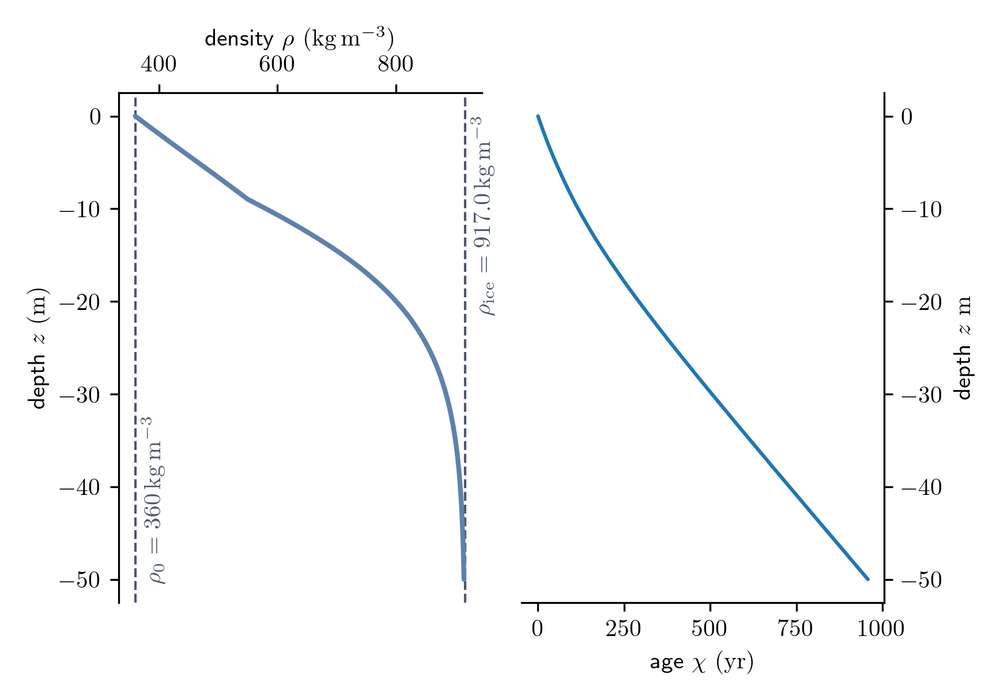
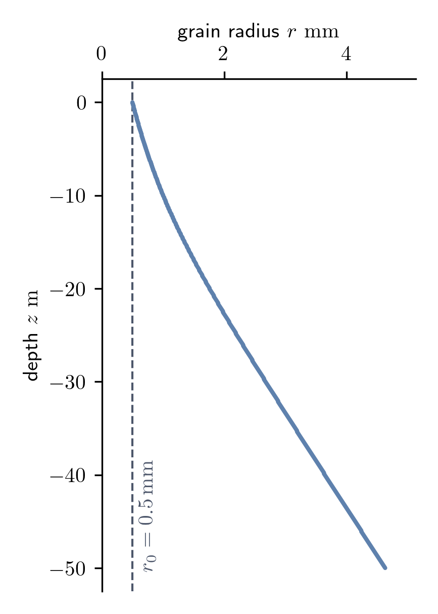
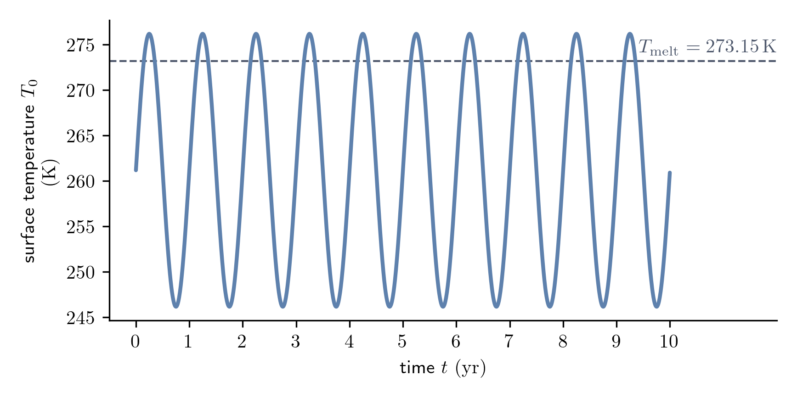
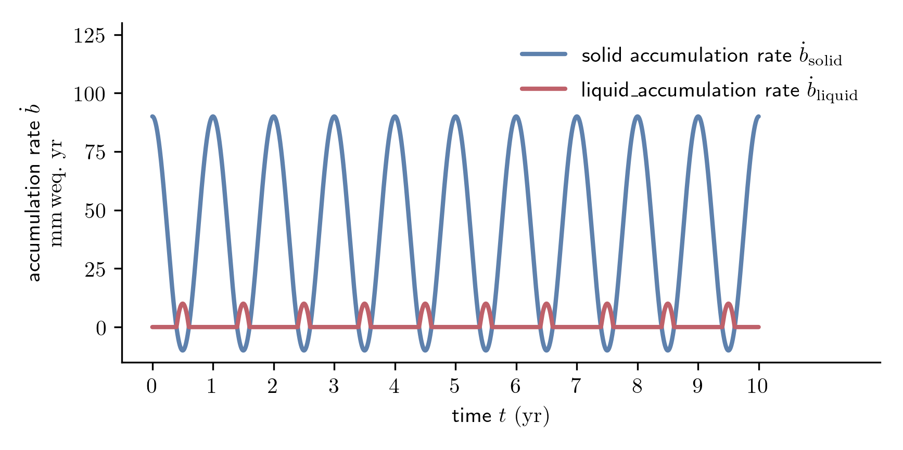

# Example

This document shall give a quick overview how the generic example case for TFM
that can be found in [`example/`](../example/) was generated.

## Initial Conditions

### depth $z$, density $\rho$, and age $\chi$
The depth was defined ranging from ${z_\mathrm{bottom} = -50 \, \mathrm{m}}$ to
${z_{top} = 0 \, \mathrm{m}}$ with 500 evenly distributed depth steps. Hence,
the initial spatial resolution is ${\Delta z = 0.1 \, \mathrm{m}}$. The
initial density and age of the profile were then computed using the analytical
model of Herron & Langway (1980). The values for the temperature and
accumulation rate needed for the computation are the mean values of the
[surface temperature](### surface temperature $T_0$)
${\bar{T} = 261.15 \, \mathrm{K}}$ and the
[solid accumulation rate](### accumulation rate $\dot{b}_\mathrm{solid}$, $\dot{b}_\mathrm{liquid}$)
${\bar{\dot{b}}_\mathrm{solid} = 40 \, \mathrm{mm  \, weq. \, yr^{-1}}}$ from
the forcing. The resulting firn and age profiles are shown in the following
figure.

**Herron, M. M. and Langway, C. C. (1980)**.
*Firn Densification: An Empirical Model.*
Journal of Glaciology 25.93, pp. 373-385.
DOI: https://doi.org/10.3189/S0022143000015239

### grain radius $r$
The initial grain radius along the firn profile is based on the growth rate
defined by Arthern et al. (2010). To compute the initial grain radius the
[age profile](### depth $z$, density $\rho$, and age $\rhi$) from the
Herron & Langway model was used. The grain radius at the surface is set
to be the
[time-independent forcing value](### surface denity $\rho_0$ and surface grain radius $r_0$)
of ${\rho_0 = 0.5 \, \mathrm{mm}}$.

**Arthern, R. J., Vaughan, D. G., Rankin, A. M., Mulvaney, R.,
and Thomas, E. R. (2010)**.
*In situ measurements of Antarctic snow compaction compared with predictions of
models.*
Journal of Geophysical Research: Earth Surface 115.F3.
DOI: https://doi.org/10.1029/2009JF001306

### temperature $T$ and liquid water content $\theta$
For convenience the initial tempature and water content were set to constant
values along the profile. The inital temperature is the
[mean surface temperature of the forcing](### surface temperature $T_0$)
${T_\mathrm{init} = 261.15 \, \mathrm{K}}$. The initital volumetric water content
is simply set to zero ${\theta_\mathrm{init} = 0.0}$.

## Forcing

### surface temperature $T_0$
For the surface temperature a simple sine fucntion is applied for the simulation
time of ${t_\mathrm{max} = 10 \, \mathrm{yr}}$. The mean value of the function
is ${\bar{T} = 261.15 \, \mathrm{K}}$, the amplitude is
${\Delta T = 15 \, \mathrm{K}}$. This results in tempeature above the pressure
melting point in the first half of the year. Accordingly, the
[solid accumuation](### accumulation rate $\dot{b}_\mathrm{solid}$, $\dot{b}_\mathrm{liquid}$)
becomes negative at that time and the
[liquid accumulation](### accumulation rate $\dot{b}_\mathrm{solid}$, $\dot{b}_\mathrm{liquid}$)
becomes positive.

### accumulation rate $\dot{b}_\mathrm{solid}$, $\dot{b}_\mathrm{liquid}$
In case of the solid accumulation a negative sine function is used for the
generic example. When surface temperatures are low, the accumulation rate is
high, and vice versa. The mean value of solid accumuation rate is
${\bar{\dot{b}}_\mathrm{solid} = 40 \, \mathrm{mm \, weq. \, yr^{-1}}}$. The
amplitude is
${\Delta \dot{b}_\mathrm{solid} = 50 \, \mathrm{mm \, weq. \, yr^{-1}}}$. This
results in negative solid accumulation, or ablation, in the second half of the
year when [surface temperatures](### surface temperature $T_0$) are above the
pressure melting point. The same amount of negative solid accumuation is defined
as positive liquid accumulation. Suggesting that the firn melts at the surface
and the generated meltwater is infiltrated.

### surface denity $\rho_0$ and surface grain radius $r_0$

The surface density is constant over the entire simulation time. It is set to
${\rho_0 (t) = 360 \, \mathrm{kg \, m^{-3}}}$. The grain radius is also constant
over time ${r_0 (t) = 0.5 \, \mathrm{mm}}$.